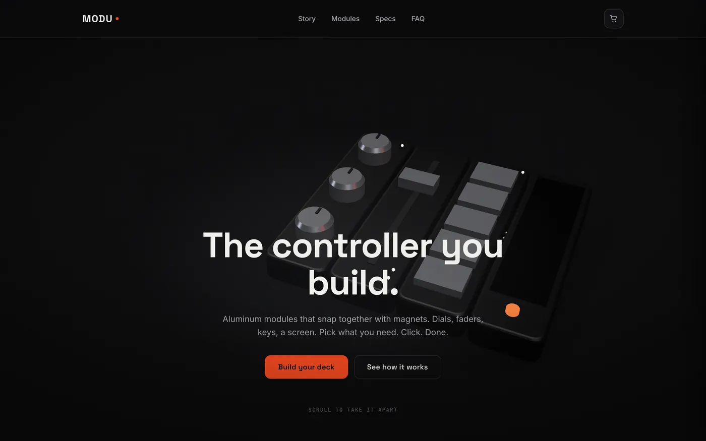
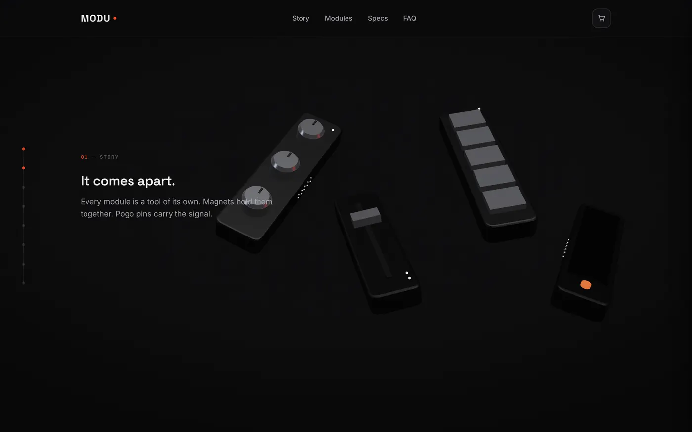
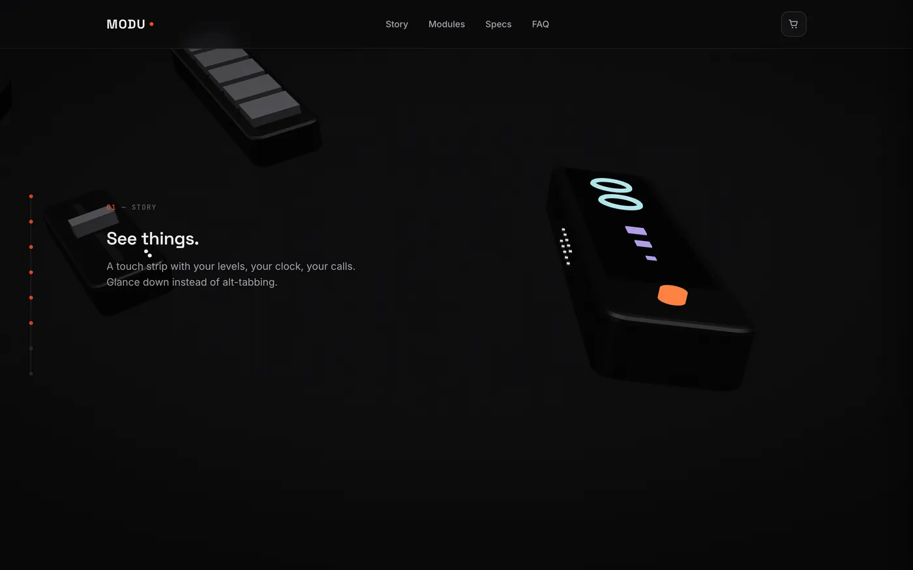
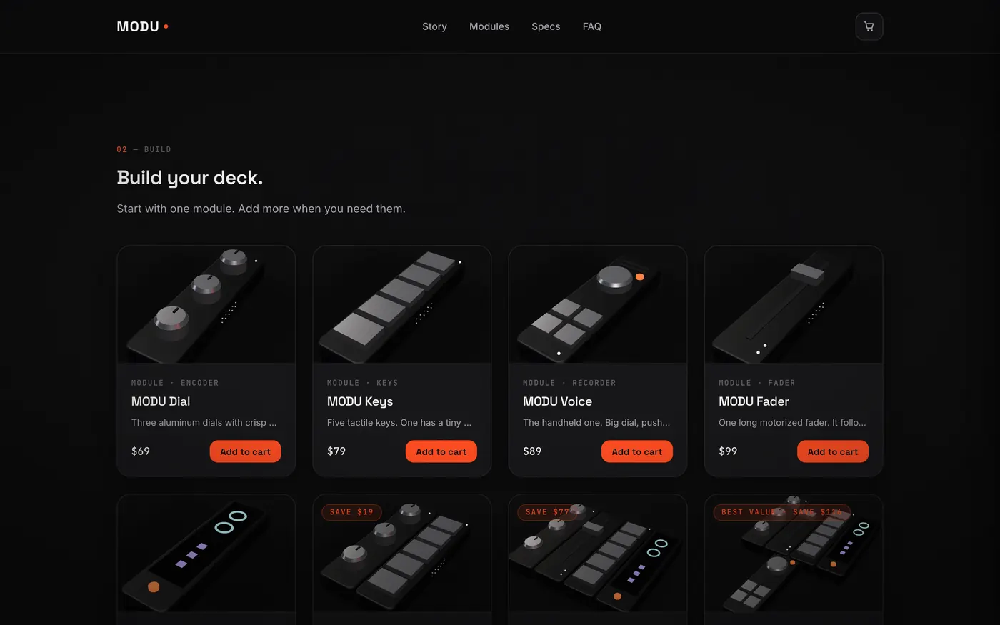
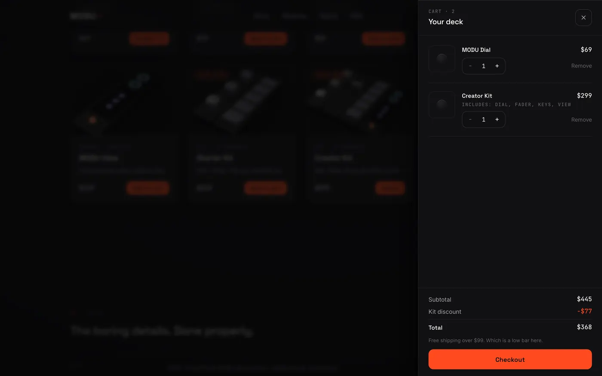
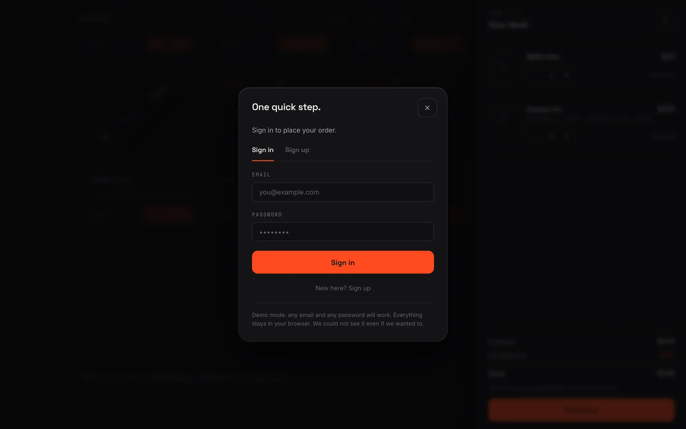
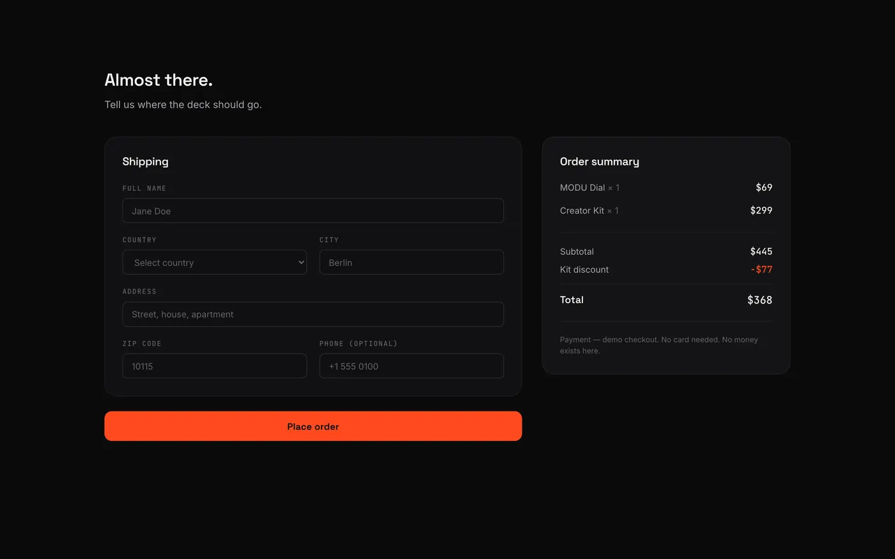
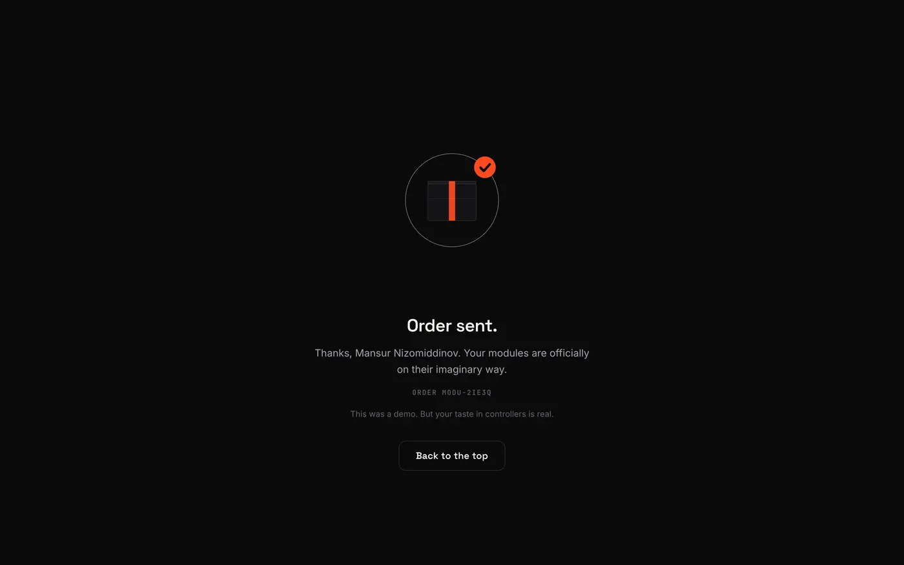

# MODU

A product site for a modular desk controller that does not exist. Eight
scroll-driven scenes take a 3D deck apart, walk through each module, and
snap it back together; a working cart, sign-in gate and checkout sit under
it. Static export, no backend, no external requests at runtime.

**Live:** https://01-modu.vercel.app/



---

## What it does

**The scroll story.** One GSAP timeline drives eight chapters over 900vh.
GSAP never touches a mesh — it tweens numbers on a plain object, and a
`useFrame` loop lerps the scene toward them. That indirection is what makes
scrubbing backwards land on exactly the same frame as scrubbing forwards,
and it is what lets reduced motion read the same values with no timeline
at all.

| | |
|---|---|
|  |  |

**The shop.** Eight SKUs, three of them kits. Every price, name and
discount comes from one catalogue file in cents; nothing is written into
JSX. Add to cart opens the drawer, checkout raises a sign-in gate, and the
order lands on a confirmation page with an SVG animation.

| | |
|---|---|
|  |  |
|  |  |



---

## Stack

- **Next.js 16** (App Router) with `output: 'export'` — the whole site is
  static HTML on a CDN
- **React 19**, **TypeScript**, **Tailwind CSS v4** (CSS-first `@theme`, no
  config file)
- **React Three Fiber / three.js** for the deck, built from primitives —
  no model files to download
- **GSAP** + **ScrollTrigger** for the timeline, **Lenis** for smooth
  scrolling
- **Zustand** + `persist` for cart, session and orders

## Why there is no backend

This is a portfolio piece, and a backend would have added running costs and
a second thing to keep alive without making the front end any better. What
a shop actually needs from a server — a catalogue, a session, an order —
is faked honestly instead:

- The catalogue is a typed module. It is the only source of prices, and
  the totals are computed from it in cents.
- Sign-in accepts any well-formed email and any password of six characters
  or more. **The password is validated and thrown away** — there is no
  field for it in the store, so nothing lands in `localStorage`.
- Placing an order writes a snapshot to `localStorage` and a token to
  `sessionStorage`, which is what guards the confirmation page against
  being opened directly.

Every screen tells the visitor this is a demo rather than pretending
otherwise.

## Running it

```bash
npm install
npm run dev
```

```bash
npm run build && npx serve out
```

The build emits a fully static `out/`. There is no server component of any
kind at runtime.

## Notes on how it is built

**The 3D never reaches a phone.** The capability check runs *before* the
canvas component is rendered, not inside it, so below 1024px or under
`prefers-reduced-motion` the three.js chunk is never requested at all.
Those visitors get stills captured from the same 3D scene at the same
poses, so the fallback is the same product from the same angle rather than
a separate illustration that drifts out of date.

**The GPU sleeps.** The canvas is fixed and stays mounted for the whole
page, but an IntersectionObserver drops the render loop to `demand` once
the hero and the story are both off screen — zero frames drawn while you
read the spec sheet.

**Zero external requests.** Fonts are self-hosted through `next/font`, the
environment lighting is built in-scene from `Lightformer`s rather than
fetching an HDR, and there is no CDN script anywhere. Load the page with
the network panel open and every request is same-origin.

**Two micro-interactions, deliberately.** Cards lean toward the pointer and
the hero CTAs are magnetic. Both are behind
`(hover: hover) and (pointer: fine) and (prefers-reduced-motion: no-preference)`,
so a touch device and anyone who asked for less motion get neither.

## Known limitations

- **Cart state does not sync between tabs.** Each tab hydrates its own
  store from `localStorage` on load; two open tabs will drift apart until
  one of them is reloaded.
- **Orders live in the browser.** Clearing site data clears the order
  history, and it never existed anywhere else.
- **The confirmation page is guarded by `sessionStorage`,** so it survives
  a reload but not a new tab — which is the intent, not a bug.
- **The 3D deck is modelled, not scanned.** Dimensions come from the
  reference render, so it reads as the product without being a CAD-accurate
  one.
- **The three.js chunk is around 255KB gzipped**, over the 180KB the spec
  hoped for. It is lazy and desktop-only, so it never touches the critical
  path; shrinking it would mean giving up the environment lighting.

## Credits

Design system, mockups and the reference 3D render were generated with
Claude Design and ported by hand; the specification, build plan and review
notes live outside this repository.

MODU is a fictional product. Nothing here is for sale.
